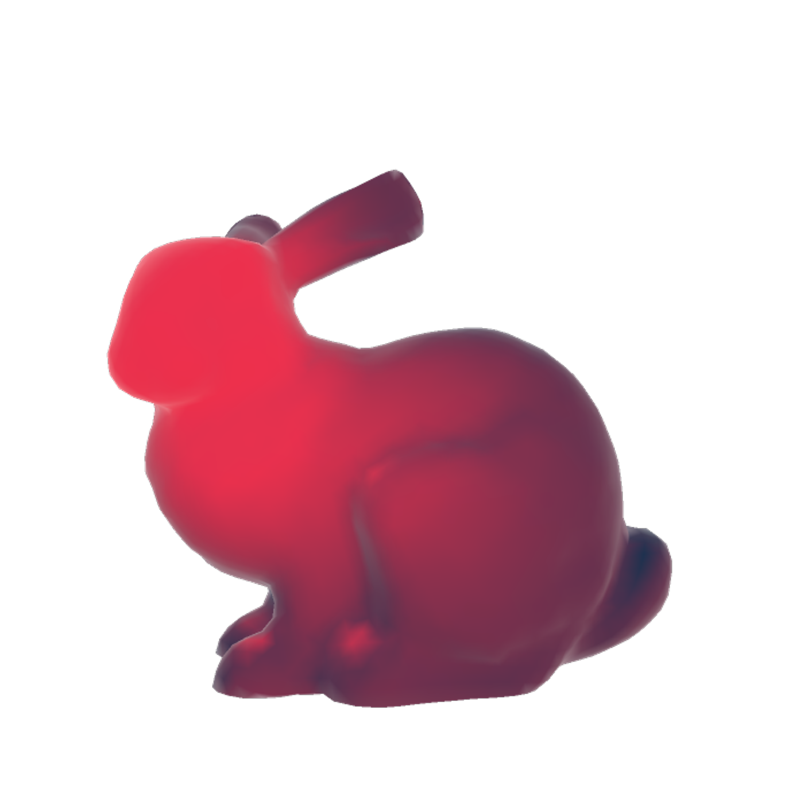
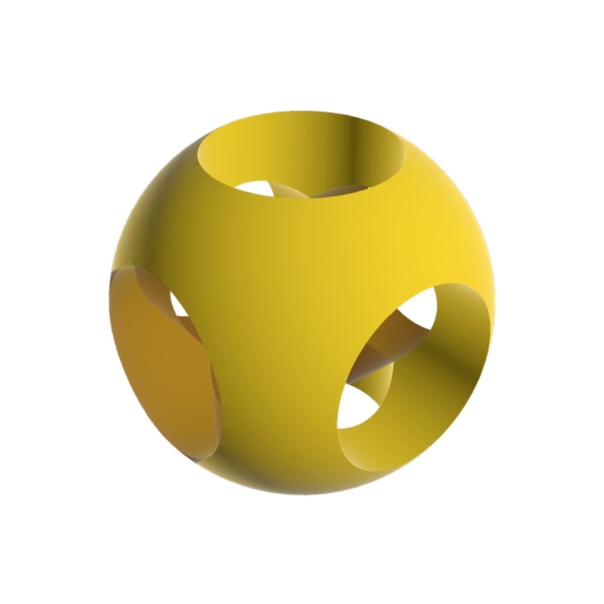

# Maquette

[](https://bernsteining.github.io/maquette/)
[](https://typst.app/universe/package/maquette)
[](https://github.com/bernsteining/maquette/actions/workflows/build.yml)
[](https://opensource.org/licenses/MIT)

**Maquette is a set of Typst plugins for embedding 3D renders directly in your documents.** Change a parameter, recompile the `.typ`, and the render lands in your PDF, no external tools, no manual re-exports, no separate asset pipeline.

**[Try it live →](https://bernsteining.github.io/maquette/)** — a browser demo runs the exact same WebAssembly the plugins ship. Drag to orbit, tweak every setting, copy the generated Typst source. The demo runs the wasm through a browser JIT rather than Typst's interpreter, so it iterates ~10× faster than a document rebuild.

## The plugins

| Package | What it renders |
|---|---|
| **[maquette](maquette/README.md)** | [STL](https://en.wikipedia.org/wiki/STL_(file_format)) / [OBJ](https://en.wikipedia.org/wiki/Wavefront_.obj_file) / [PLY](https://en.wikipedia.org/wiki/PLY_(file_format))|
| **[maquette-gltf](crates/maquette-gltf/README.md)** | [glTF](https://www.khronos.org/gltf/) 2.0 (`.glb` / `.gltf`) with PBR, IBL, KHR_materials_* extensions, Draco, quantization |
| **[maquette-scad](crates/maquette-scad/README.md)** | [OpenSCAD](https://openscad.org/) sources → maquette rendering |

# Usage

<table>
<tr><th align="left">Code</th><th>Render</th></tr>
<tr>
<td>

```typst
#import "@preview/maquette:0.1.3": render-obj

#render-obj(
  read("bunny.obj"),
  up: (0, 1, 0),
  azimuth: 180,
  distance: 0.25,
  lights: (
    (
      type: "positional",
      vector: (-0.1, 0.14, -0.04),
      color: "#ff0000",
      intensity: 3.0,
    ),
  ),
  sss: (
    intensity: 4,
    power: 3.5,
    distortion: 0.2,
  ),
  background: none,
)
```

</td>
<td><a href="https://bernsteining.github.io/maquette/?model=bunny.obj&up=%5B0%2C1%2C0%5D&azimuth=180&distance=0.25&lights=%5B%7B%22type%22%3A%22positional%22%2C%22vector%22%3A%5B-0.1%2C0.14%2C-0.04%5D%2C%22color%22%3A%22%23ff0000%22%2C%22intensity%22%3A3%7D%5D&sss=%7B%22intensity%22%3A4%2C%22power%22%3A3.5%2C%22distortion%22%3A0.2%7D&background=%22none%22" title="Open in the live demo"></a></td>
</tr>
<tr>
<td>

```scad
// example.scad
$fn = 100;
module rod(d, h) cylinder(h, d = d, center = true);
hole = 25;
len = 62.5;
difference() {
  sphere(d = 50);
  rod(hole, len);
  rotate([90, 0, 0]) rod(hole, len);
}
color([0.5, 0.3, 0.1, 0.6])
rotate([0, 90, 0]) rod(hole, len);
```

```typst
#import "@preview/maquette-scad:0.1.0": compile-scad
#import "@preview/maquette:0.1.3": render-ply

#render-ply(
  compile-scad(read("example.scad"), smooth-normals: 30),
  azimuth: 219,
  elevation: 33,
  up: (0, 1, 0),
  fov: 40,
  zoom: 1.2,
  color: "#f9d72c",
  specular: 0,
  cull_backface: false,
  background: none,
)
```

</td>
<td><a href="https://bernsteining.github.io/maquette/?model=openscad-logo.scad&azimuth=219&elevation=33&up=%5B0%2C1%2C0%5D&fov=40&zoom=1.2&color=%22%23f9d72c%22&specular=0&cull_backface=false&background=%22none%22" title="Open in the live demo"></a></td>
</tr>
<tr>
<td>

```typst
#import "@preview/maquette-gltf:0.1.0": render-gltf

#render-gltf(read("tokyo.glb", encoding: none), (
  camera: (290, 464, 774),
  center: (-86, 5, -25),
  up: (0, 1, 0),
  fov: 40,
  time: 6.0,
  background: none,
))
```

</td>
<td><a href="https://bernsteining.github.io/maquette/?model=tokyo.glb&camera=%5B290%2C464%2C774%5D&center=%5B-86%2C5%2C-25%5D&up=%5B0%2C1%2C0%5D&fov=40&time=6&background=%22none%22" title="Open in the live demo"></a></td>
</tr>
</table>

## Documentation

Documentation contains many examples showcasing all the features, with each example being a clickable image redirecting to its live demo version, allowing you to easily discover features.

* [maquette](docs/maquette-documentation.pdf)
* [maquette-scad](docs/maquette-scad-documentation.pdf)
* [maquette-gltf](docs/maquette-gltf-documentation.pdf)


## Building

```sh
make build       # compile maquette (STL/OBJ/PLY) wasm
make gltf-build  # same for maquette-gltf
make scad-build  # same for maquette-scad
make demo        # assemble the browser demo — three wasm modules + assets in docs/
make docs        # compile docs/maquette-documentation.pdf + -gltf-doc + -scad-doc
```

Requires `cargo`, the `wasm32-unknown-unknown` target, and `wasm-opt` from [binaryen](https://github.com/WebAssembly/binaryen).

